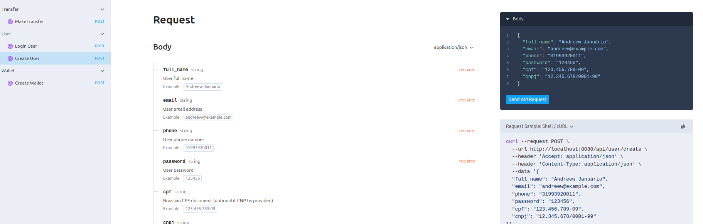

# Fintech MVP

## Sobre o projeto

O principal use case do projeto é a transferência entre dois usuários, um usuário comum e um lojista. 

Antes de finalizar a transferência, um serviço externo deve ser consultado para verificar se ela pode ser aprovada.

Caso a transferência seja autorizada, é feito o envio de notificação por e-mail e por SMS.

Em caso de erro na transferência, um log de erro deve ser registrado e a operação deve ser cancelada.

## Sobre o Projeto

O objetivo do projeto é criar algo o mais agnóstico possível ao framework.

Optei pelo uso de DDD, utilizando bastante os Object Calisthenics e linguagem ubíqua. Usei também Value Objects para usar a obsessão por tipos primitivos e realizei o tratamento das requisições fora do framework.

Decidi usar o ORM do Laravel para agilizar o desenvolvimento, mas tomei o cuidado de deixá-lo desacoplado, facilitando a troca do ORM futuramente, caso necessário.

Para as chamadas dos provedores de autenticação e envio de notificação, implementei uma lógica com três tentativas. Caso todas falhem, é registrado um log de erro e a mensagem é enviada para uma Dead Letter Queue, aumentando a resiliência do sistema.

Em alguns trechos do código, utilizei chamadas estáticas, principalmente com Log, DB, Event, Auth e nos mappers. Fiz isso de forma intencional e restrita à camada de infraestrutura, onde esse tipo de acesso faz mais sentido.

No caso das facades do Laravel, elas estão encapsuladas dentro de classes adaptadoras (como LaravelLoggerAdapter ou LaravelTransactionManager), garantindo que o restante da aplicação continue desacoplado do framework.

Já nos mappers, o uso de métodos estáticos foi uma escolha prática, pois eles não mantêm estado e servem apenas para converter dados.

Caso o projeto cresça ou surja a necessidade, é possível substituir essas chamadas por injeções de dependência sem impactos, já que tudo está bem isolado.

## Regras de negócio da implementação

- Um usuário precisa ter nome completo, CPF ou CNPJ (único), e-mail (único), telefone e senha (mínimo de 6 caracteres).

- Após o usuário ser criado, ele deve chamar a rota de criação de carteira (Create/Wallet) passando o tipo desejado.

- O que diferencia um lojista de um usuário comum é sua carteira, já que hoje é possível realizar operações como lojista apenas com o CPF.

- Não há rota de saldo, mas é possível editar diretamente a coluna balance da tabela wallets (no seeder, deixei um usuário comum com saldo).

- A principal regra da transferência é que o lojista só pode receber valores, enquanto o usuário comum pode enviar e receber.

- Para fazer uma transferência, o usuário precisa apenas passar o ID do recebedor. O pagador precisa estar logado, pois suas informações já estarão disponíveis.

- Caso a transferência não seja autorizada, o valor não deve ser debitado da conta do pagador, e nenhuma notificação deve ser enviada.

- A transferência é feita de forma síncrona, mas as notificações são enviadas via evento. Esse evento envia as mensagens para o producer no RabbitMQ. Ao serem consumidas, o provedor de notificação é validado e, se houver falha, a mensagem é enviada para a DLQ.

## Fluxo de transferência

1. Criação dos usuários
2. Criação das wallets dos usuários
3. Transferência entre wallets passando o ID do recebedor
4. Ativação das filas para envio das notificações
5. Ativação do consumer ```bash consumer:notify ``` para o consumo das notificações


# Configuração do projeto e comandos necessários

## Configuração Docker

Permissão para executar o script de setup
```bash
chmod +x setup.sh
```

Automação com os passos necessários para subir o projeto
```bash
./setup.sh
```

## Documentação da API

Assim que o projeto estiver pronto, basta acessar:
```bash
http://localhost:8080/docs/api/
```
A documentação foi feita com a lib Scramble e nela tem um exemplo de request body para cada endpoint, onde é possível copiar e colar o curl.
Mas também deixo um arquivo na raiz do projeto dentro da pasta 'Dev' onde está o arquivo de exportação do insominia.




#### Usuários do seeder
Type : Common
Balance : 100000
```bash
{
	"email": "andreew@gmail.com",
	"password": "123456"
}
```
Type : shop_kepeer
Balance : 0
```bash
{
	"email": "alecssander@gmail.com",
	"password": "123456"
}
```

## RabbitMQ

``` http://localhost:15672/ ```
```bash
{
	"Username": "guest",
	"password": "guest"
}
```
## CI/CD

Assim que um push for para a branch main ele vai rodar o php stan e os testes.
Se preferir rodar separadamente, seguem os comandos:

### Phpstan

```bash
docker exec -it app php artisan phpstan:analyse
```

### Testes

Para rodar o phpstan os testes basta rodar o comando abaixo
No sail
```bash
docker exec -it app php artisan test
```

## Queue
Para rodar o queue basta rodar o comando abaixo
```bash
docker exec -it app php artisan queue:work
```

## Consumer
Para consumir as notificações basta rodar o comando abaixo
```bash
docker exec -it app php artisan consumer:notify
```

## O que eu faria para melhorar o projeto no futuro

- Melhoraria a observabilidade com o monolog e talvez um sentry/newrelic
- Usaria swoole em um projeto de microserviços atuando como consumer
- Se o volume de mensagens alterar, seria melhor utilizar o kafka
- Elevaria o nível do PhpStan para no mínimo 6
