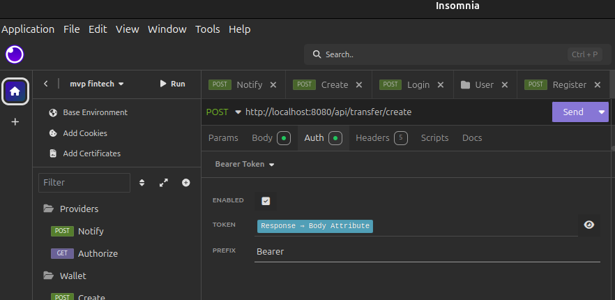

# Fintech MVP

## Sobre o projeto

O principal UseCase do projeto é a transferência entre dois usuários, no caso serão um usuário comum e um logista, antes de finalizar a transferência, deve ser consultado um serviço externo e verificar se podemos aprovar a transferência.
Caso a transferência seja aprovada, é feito um envio de notificação por email e por sms.

Em caso de erro na transferência, deve ser registrado um log de erro e também a transferência deve ser cancelada.

## Sobre o Projeto

O objetivo do projeto é criar algo mais agnóstico ao framework possível.

Optei pelo uso do DDD, utilizando muito do Objects calisthenics, linguagem ubiqua, utilizei os Value Objects para ajudar com a obsessão por tipos primitivos e tratamento de requests fora do framework.

Optei por utilizar o ORM do laravel para agilizar o desenvolvimento, mas tomei o cuidado de deixar de uma forma onde caso fosse alterado o ORM no futuro, o desacoplamento deixaria a implementação mais fácil.

Para a chamada dos provedores de autenticação, e envio de notificação, foi feito três tentativas e caso falhe, será registrado um log de erro juntamento com o envio da mensagem para uma Dead letter queue, almentando a resilência.

## Regras de negócio da implementação

 - Um usuário precisa ter Nome Completo, CPF/CNPJ (unico), EMAIL (unico), Telefone, Senha (Min 6 Caracteres).
 - Após o utilizador ser criado ele deve chamar a rota de criação da carteira(Create/Wallet) passando o tipo de carteira desejada.
 - O que difere um lojista de um utilizador comum é a sua carteira, já que hoje é possível fazer operações como lojista apenas com o CPF.
 - Não há rota de saldo mas basta ir até a tabela 'wallets' na coluna 'balance' para adicionar (no seeder deixei um usuário comum com saldo).
 - A principal regra da transferência é que o Logista só pode receber valores, e o usuário comum recebe e envia.
 - Para fazer a transferência o usuário precisa apenas passar o id do usuário que irá receber, pois é necessário que o pagador esteja logado, pois com o usuário logado, já possuímos as suas informações.
 - Caso a transferência não tenha sucesso não deve ser debitado o valor da conta do pagador e também não deve ser enviado a notificação para o recebedor.
 - A tranferência é feita de forma sincrona mas as notificações são enviadas através do evento disparado ao obter sucesso, onde são enviadas para o producer no rabbitmq e ao serem consumidas, a validação do provedor é executada e caso não seja autorizada, a mensagem da notificação vai para uma DLQ.

## Fluxo de transferência

1. criação dos usuários
2. criação dasd wallets dos usuários
3. tranferência entre wallets através do Id do usuário
4. ativação das filas para ativar a notificação
5. ativação do consumer ```bash consumer:notify ``` para o envio das notificações


# Configuração do projeto e comandos necessários

## Configuração Docker

Permissão para executar o script de setup
```bash
chmod +x setup.sh
```

Automação com os passos necessários para subir o projeto
```bash
./setup.sh
```

## Documentação da API

Assim que o projeto estiver pronto, basta acessar:
```bash
http://localhost:8080/docs/api/
```
A documentação foi feita com a lib Scramble e nela temo um exemplo de request body para cada endpoint, onde é possivel copiar e colar o curl.
Mas tambem deixo um arquivo na raiz do projeto com o nome de 'Dev' onde está o arquivo de exportação do insominia.




#### Usuários do seeder
Type : Common
Balance : 100000
```bash
{
	"email": "andreew@gmail.com",
	"password": "123456"
}
```
Type : shop_kepeer
Balance : 0
```bash
{
	"email": "alecssander@gmail.com",
	"password": "123456"
}
```

## RabbitMQ

``` http://localhost:15672/ ```
```bash
{
	"Username": "guest",
	"password": "guest"
}
```
## CI/CD

Assim que um push for para a branch main ele vai rodar o php stan e os testes.
Se preferir rodar separadamente, seguem os comandos:

### Phpstan

```bash
docker exec -it app php artisan phpstan:analyse
```

### Testes

Para rodar o phpstan os testes basta rodar o comando abaixo
No sail
```bash
docker exec -it app php artisan test
```

## Queue
Para rodar o queue basta rodar o comando abaixo
```bash
docker exec -it app php artisan queue:work
```

## Consumer
Para consumir as notificações basta rodar o comando abaixo
```bash
docker exec -it app php artisan consumer:notify
```

## O que eu faria para melhorar o projeto no futuro

- Melhoraria a observabilidade com o monolog e talvez um sentry/newrelic
- Usaria swoole em um projeto de microserviços atuando como consumer
- Se o volume de mensagens alterar, seria melhor utilizar o kafka
- Elevaria o nivel do PhpStan para no minimo 6
